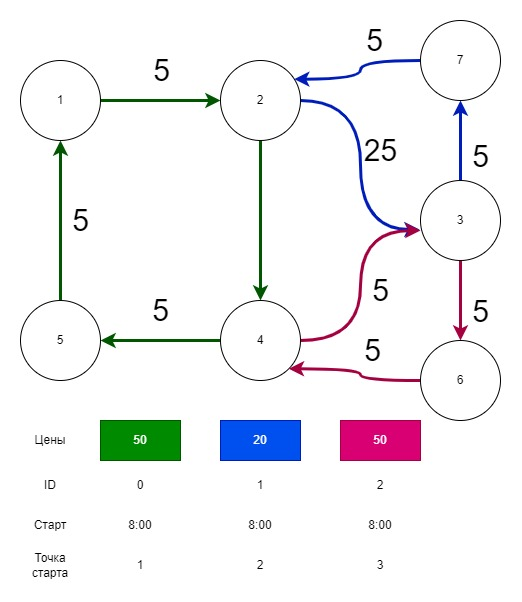

Схема TestData2.txt

Как запустить:
Выюрать SampleApplication как звпускаемый проект.
Запустить.
Ввести путь к файлу с данными.
Ввести точку отправки и точку куда желаете попасть.
Ввести время
Выбрать алгоритм 

<!--- 
Вынести схожие последовательности сегментов в отдельный Route
Перевести общие классы на generic, что бы можно было наследовать транспорт, участки пути и тд

=> ???
record Route
{
	// добавить Номер маршрута

	public IEnumerable<RouteSegments> RouteSegments {get;}
	public IEnumerable<Transport> Transports {get;}
}

испльзовать словарь в сегментах.
Dictionary<Transport,DateTime> За сколько проходит транспорт сегмент.
Тогда сократиться кол-во схожих сегментов.

добавить хеширование

отрефакторить код

добавть логеры

blazor UI

проверить проблему с 2+ пересадками в рассчёте веса
когда до приезда на остановку уже совешён цикл следующего транспорта.

Добавить механизм кеширования времени в TimeRespectWeighter
Dictionary<RouteSegment,TimeOnly> во сколько времени окажемся на жтом сегменте. Или другая импл

Написать тест для взвешивания по времени. Возможно есть баг

-->